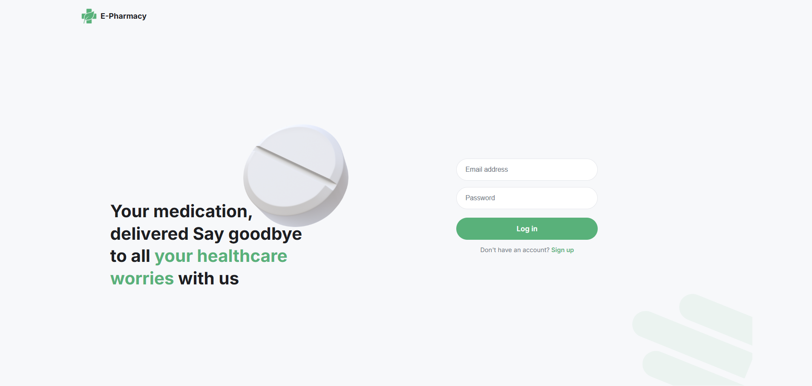
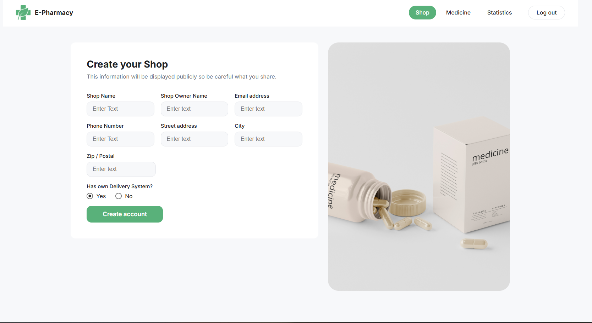
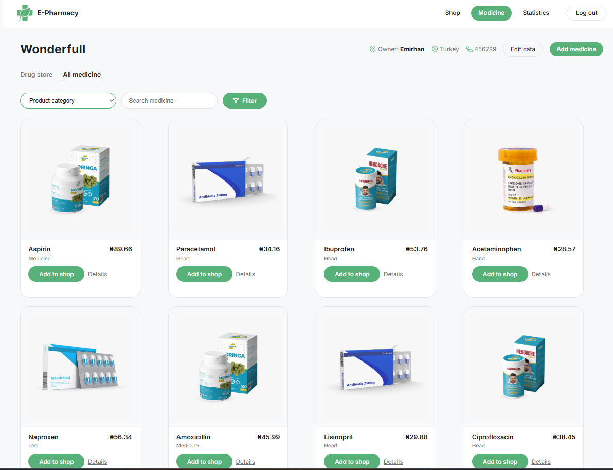
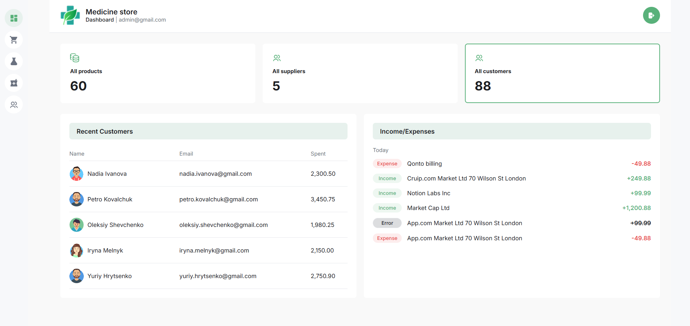
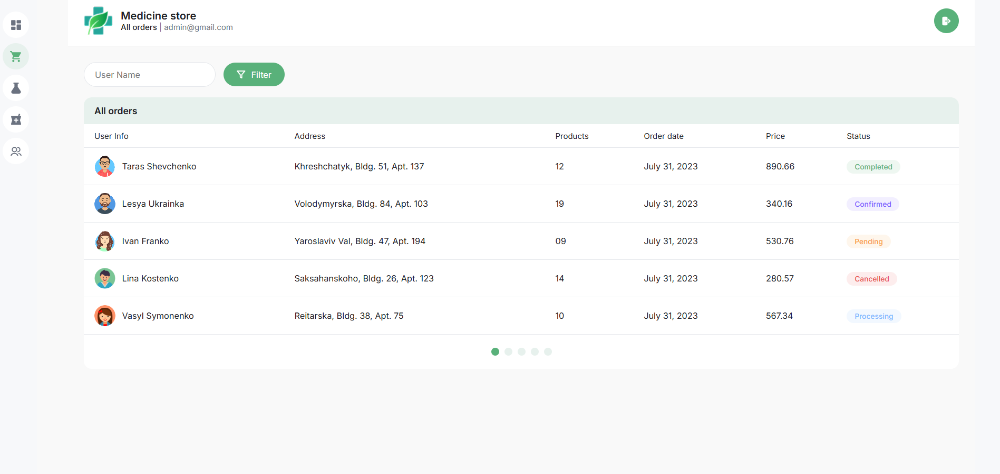
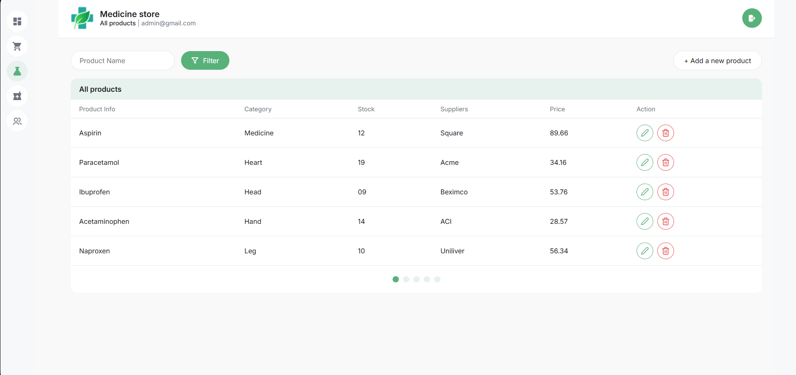
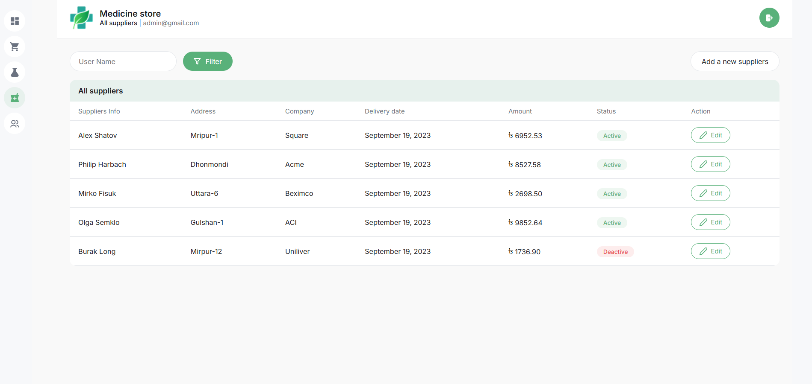
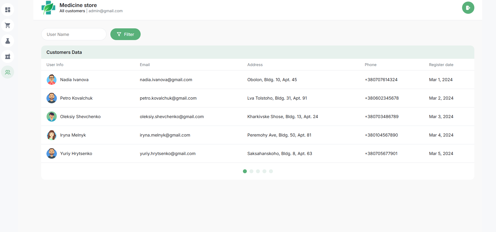

# 💊 E-Pharmacy

A full-stack e-pharmacy web application built with React and Node.js. It includes a vendor-facing shop management system and a fully featured admin panel for managing the entire platform.

🌐 **Live Demo:** [e-pharmacy-phi.vercel.app](https://e-pharmacy-phi.vercel.app)  
💼 **Developer:** [Emirhan Buyuksenirli](https://www.linkedin.com/in/emirhan-buyuksenirli/)

---

## 📸 Preview

### 🔐 Login


### 🛒 Shop


### 💊 Medicine Store


### 📊 Admin Dashboard


### 📦 Admin Orders


### 🧪 Admin Products


### 🏭 Admin Suppliers


### 👥 Admin Customers


---

## ✨ Features

### 🧑‍💼 Vendor Side
| Feature | Description |
|---|---|
| Register & Login | JWT-based authentication with form validation |
| Pharmacy Profile | Create and edit your pharmacy name, address, owner and phone |
| Drug Store | Add, edit and delete medicines from your own store |
| All Medicine | Browse the full medicine catalogue with category and search filters |
| Add to Shop | Pick any medicine from the catalogue and add it to your store |
| Medicine Detail | View full details of any medicine |
| Statistics | Visual overview of store performance |

### 🛡️ Admin Side
| Feature | Description |
|---|---|
| Admin Login | Separate secure admin authentication |
| Dashboard | Live stats for products, suppliers and customers — click each card to switch the data table |
| Orders | View all orders with status badges and pagination |
| Products | Full CRUD — add, edit, delete products with category filter and pagination |
| Suppliers | Manage suppliers with Active/Deactive status badges and pagination |
| Customers | Browse all customers with avatar, contact info and pagination |

---

## 🛠️ Tech Stack

### Frontend
- **React 18** + **Vite**
- **React Router v6** — client-side routing
- **React Hook Form** + **Yup** — form validation
- **Axios** — HTTP client
- **CSS Modules** — scoped component styling
- **SVG Sprite** — single file icon system

### Backend
- **Node.js** + **Express**
- **JWT** — authentication for both vendor and admin
- **JSON file storage** — lightweight data persistence
- **REST API** — products, orders, suppliers, customers, pharmacy

### Deployment
- **Frontend** → [Vercel](https://vercel.com)
- **Backend** → [Render](https://render.com)

---

## 🚀 Getting Started

### Prerequisites
- Node.js 18+
- npm

### 1. Clone the repository

```bash
git clone https://github.com/Emirhan-bs/e-pharmacy.git
cd e-pharmacy
```

### 2. Install dependencies

```bash
# Frontend
npm install

# Backend
cd e-pharmacy-backend
npm install
```

### 3. Configure environment

Create a `.env` file in the project root:

```env
VITE_API_URL=http://localhost:3001
```

### 4. Run the project

```bash
# Terminal 1 — start backend
cd e-pharmacy-backend
node server.js

# Terminal 2 — start frontend
cd ..
npm run dev
```

Open [http://localhost:5173](http://localhost:5173) in your browser.

---

## 🔑 Test Credentials

### Admin
```
Email:    admin@gmail.com
Password: admin123
```

### Vendor
```
Register your own account at /register
```

---

## 📁 Project Structure

```
e-pharmacy/
├── src/
│   ├── api/              # Axios API calls
│   ├── assets/           # Images, SVG sprite, screenshots
│   ├── components/
│   │   ├── AdminLayout/  # Sidebar navigation
│   │   ├── Pagination/   # Reusable pagination dots
│   │   ├── modals/       # Add/Edit/Delete modals
│   │   └── SharedLayout/ # Vendor header + footer
│   ├── hooks/            # useAdminLogout
│   ├── pages/
│   │   ├── AdminDashboard/
│   │   ├── AdminOrders/
│   │   ├── AdminProducts/
│   │   ├── AdminSuppliers/
│   │   ├── AdminCustomers/
│   │   ├── LoginPage/
│   │   ├── RegisterPage/
│   │   ├── ShopPage/
│   │   ├── DrugStorePage/
│   │   ├── StatisticsPage/
│   │   └── MedicineDetailPage/
│   ├── App.jsx
│   └── main.jsx
└── e-pharmacy-backend/
    ├── server.js
    ├── middleware/
    └── data/
        ├── products.json
        ├── suppliers.json
        ├── customers.json
        ├── orders.json
        └── Income-Expenses.json
```

---

## 📡 API Endpoints

### Auth
| Method | Endpoint | Description |
|---|---|---|
| POST | `/api/user/register` | Register vendor |
| POST | `/api/user/login` | Vendor login |
| GET | `/api/user/current` | Get current vendor |
| POST | `/api/admin/login` | Admin login |
| GET | `/api/admin/current` | Get current admin |

### Pharmacy
| Method | Endpoint | Description |
|---|---|---|
| POST | `/api/pharmacies` | Create pharmacy |
| GET | `/api/pharmacies/my` | Get own pharmacy |
| PUT | `/api/pharmacies/my` | Update pharmacy |

### Admin
| Method | Endpoint | Description |
|---|---|---|
| GET | `/api/admin/products` | List all products |
| POST | `/api/admin/products` | Add product |
| PUT | `/api/admin/products/:id` | Edit product |
| DELETE | `/api/admin/products/:id` | Delete product |
| GET | `/api/admin/suppliers` | List all suppliers |
| GET | `/api/orders` | List all orders |
| GET | `/api/customers` | List all customers |
| GET | `/api/dashboard` | Dashboard stats |

---

## 🗺️ Roadmap

- [ ] MongoDB integration for persistent data
- [ ] Image upload for products
- [ ] Order status management from admin panel
- [ ] Dark mode
- [ ] Mobile responsive admin panel

---

## 👨‍💻 Developer

Made with ❤️ by **Emirhan Buyuksenirli**

[](https://www.linkedin.com/in/emirhan-buyuksenirli/)
[](https://github.com/Emirhan-bs)

---

> ⭐ If you found this project useful, consider giving it a star on GitHub!